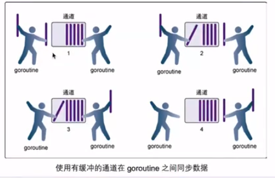
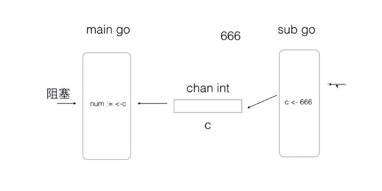
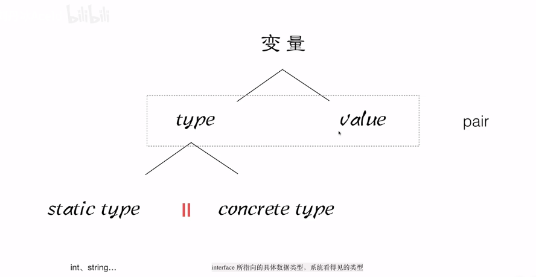
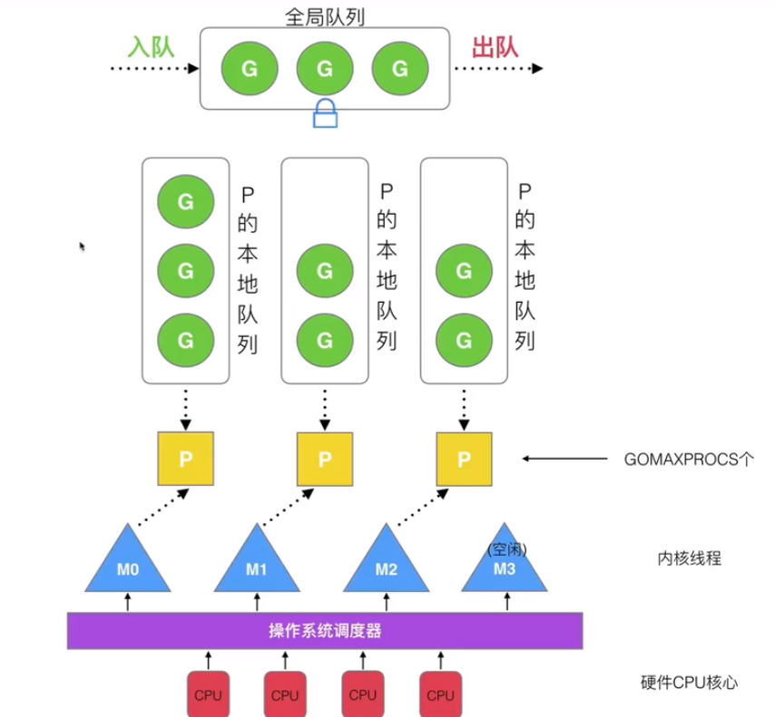

<div style="text-align: center;"><h1>GO 学习笔记 </h1></div>

# 文件模块初始化

+ 先判断是否有导包`import`，若有按顺序依次进入到该文件，并循环判断，直到无导包为止
+ 先初始化常量（或枚举）`const`
+ 初始化全局变量`var`
+ 执行初始化函数`init()`
+ 返回上一个入口，如此往返，直到最初的入口
+ 执行主函数`main()`


# 指针

## 1. 值传递

+ 先对形参开辟内存 并赋默认值
+ 将实参的值赋值给形参 （仅改变行参的值）
+ 在调用函数内对形参进行操作
  

## 2. 地址传递

+ 形式参数是某一个类型的地址
+ 实际参数为地址 使用`&`可以获取变量地址
+ 形式参数储存的是实际参数的地址
+ 在调用函数内实际上是对地址指向的内存进行操作(使用`*`可以获取地址对应内存的变量)

**指针可以嵌套，可以获取指针的指针，多个`*`也可以分别获取低级指针的地址或实际值**


# 关键字特性

## 1. var和:=

+ 变量类型有`int\8\16\32\64`整形、`string`字符串、`bool`布尔、`float32\64`浮点形,默认值为内存全0,不存在为`nil`
+ `var`用来声明变量,形式如`var name type`或`var name type = value`，使用`var name=value`可以省略类型进行推导

```go
var(
f1 int
f2 string
f3 float32
f4 bool
)

```

+ 当多个变量需要声明时，可以使用`var(name1 type1,name2 type2,……)`
+ `name := value` 可以省略type和var进行类型推导
+ `:=`不能用于全局变量赋值

## 2. const 和 iota

+ `const`用于定义常量格式为`const name type = value`或`const name = value`
+ 用于定义枚举变量`const(name1=value \n name2=value)`
+ 若使用`iota`可以让枚举自动按数字和规则递增,**`iota`初始为0，每一行+1,每一行的计算规则和上一行一致**

```go
const(
CN = iota + 5
USA
JP = iota*10
FH
)
// CN=5 USA=6 JP=20 FH=30
```

## 3. func

+ `func` 用于定义函数，格式为`func name(per)(return){}`,可以定义多个参数和多个返回值
+ 返回值可以以形参的方式进行声明,其默认值为内存0填充,在函数体中可以对其进行赋值,**若不return值将返回声明的返回形参**
+ 调用有返回值的函数,可以接收多个返回值,**若接收个数少于返回个数,按照返回声明的先后顺序返回之前的**
+ 可以在一个函数内添加匿名函数，其定义和普通函数相同但没有函数名，**需要在最后的}后加入()及其参数表示执行该函数**
```go
package main
func main(){
	go func(){
		println("222")
    }() // ()表示无参数执行
    
    func(val int){
    	println("val is ",val)
    }(10) // 传入参数并执行
}

```
```go
func funcsn(str string, num int) (ans1 int, ans2 string) {
fmt.Println("str= ", str)
fmt.Println("num= ", num)

// 直接返回两个也可以
//return 100,"ans"

ans1 = num * 10
ans2 = str + "a"
return
}
```

## 4. defer

+ `defer`关键字 修饰的语句 将在其他当前函数体内其他语句执行完毕，函数调用结束前生效

+ **若有多个 `defer` 关键字 ，将依次压栈，按照先进后出原则执行**

+ **若`return`调用函数 且存在`defer` 语句 则 `return`先于`defer`执行  (`defer`最先入栈，在`}`前被调用)**
  

## 5. type和struct

+ `type`关键字可以声明自定义的类型或者是已有类型的别名,`type name TYPE`
+ `struct`可以声明结构体,配合`type`可以声明自定义类型

```go
type num int

type stu struct {
name string
age int
isBoy bool
}

func main() {
// 和普通类型一样使用
var nums num = 10
fmt.Println(nums)
var student stu
fmt.Println(student)
}
```

## 6. interface

+ `interface`用于标记接口，其格式如下

```go
type IO interface{
Reader() string
Write(val string)
}
```

+ 当一个结构体全部实现方法内定义的函数时候即表示实现了该接口

```go
type File struct{
Name string
Size float64
Val string
}

func (t *File) Reader() string{
return t.Val
}

func (t *File) Write(val string){
t.Val = val
}
```

+ **其中`(t *File)`为指针接收器 表示该函数属于File结构体，同理可以使用值接收器（`不带*`)**
+ `interfa{}`表示空接口，**即所有数据类型和结构体**，用于接收一切，类似于JAVA的`Object`

## 7. make和new

+ `make`用于给非固定长度的数据来开辟内存空间，例如`slice`、`map`等，使用方法为

```go
slice:= make([]int, 4, 5)
```

其中参数为数据类型，长度（len）和容量（cap）

## 8. go
+ `go` 用于启动一个`goroutine`,一个goroutine即一个协程（剥离CPU调度的线程）
+ `go`后面跟上一个函数方法或者匿名函数
+ **当`main`退出后，所有的`goroutine`都将停止**

## 9.select
+ `select-case`用于监听多路`channel`
+ 每一个case分支对应一个channel的读写行为，当某一路可以执行时会执行当前路，不会按顺序阻塞
+ 配合`for-select-case`可以对多个channel进行监听
```go
package main
func task(c1,c2,c3,c4 chan int){
  var x,y int
	for{
		select{
		case x=<-c1:y=x
		case c2<-y:y=x+y
		case y=<-c3:x=y+x
		case c4<-x:y=x
        }
    }
}
```

# 数据结构

## 1. slice

+ 固定数组在传递时为值传递 且形参和实参必须是统一类型（类型、长度）
+ 当数组不声明长度是为切片(`slice`),是可变长度的动态数组,其作为参数时传递的是 引用
+ 动态数组是内存的切片，可以使用`make()`来声明类型、大小和容量并开辟内存空间，其头指针在最前，尾指针指向最后一个合法元素
+ 若初始化切片时候没有声明容量，容量将和大小相同
+ 长度`len`表示是当前空间中合法的内存数量（头尾指针间的数量，有值）,,容量`cap`表示切片容量大小(已经开辟的内存空间),使用`append()`可以在之后追加
  
+ 若容量已满后继续追加，**将按照之前容量扩大一倍**  
  
+ 可以使用`[a:b]`来对`slice`进行切片(**引用拷贝**),**脚标左闭右开**,一边留空表示从头或尾部，两边留空表示拷贝全部
+ 使用`copy(new,org)`可以将org的值复制给new(**值拷贝**),new容量不足时会自动开辟，但类型需一致

## 2. map

+ 使用`map[key]value`可以声明键值对并声明键值类型
+ 使用`map[k]=v`进行添加操作
+ 使用`delete(map,k)`进行删除操作
+ 使用`map[ok]=nv`进行修改操作
+ 使用`map[k]`进行查找获取值
+ **当删除key不存在时不会报错，当查找key不存在时为相同类型的0内存填充**

## channel
+ `channle`是一种内嵌的数据结构用于在不同的goroutine间传递消息，其需要被初始化才可以使用
+ 定义为`ch:=make(chan X,n)`,X为传递的类型，n为缓冲区大小可以省略
+ 使用 `ch<- x`可以向通道中写入数据，`<-ch`可以消费数据，若需要接收可以使用`data,ok:=<-ch`，其中data为其中的数据，ok表示该管道是否还有数据或是否关闭
+ 当多个并发goroutine使用管道进行消息传递时，若两个不同步且缓冲区无或已满则当一方到达写入或消费时候会阻塞等待另一方到达后才会执行
+ 当有缓冲区存在时候，写入方和读取方会依次写入和读取直到缓冲区写满或为空时才会阻塞
+ 使用`close(ch)`可以关闭管道，当管道关闭后写入会报错，若管道有缓存则可以继续读取





# 面向对象

## 1. 结构体struct

+ `struct`可以声明结构体,配合`type`可以声明自定义类型

```go
// 声明一个结构体
type stu struct {
name string
age int
isBoy bool
}
```

+ 使用`name.key`可以给结构体内的属性赋值,也可以使用`name := obj{a,b,c}`来推导声明并赋值一个自定义类型
+ 在函数中当自定义对象作为参数时候其为**值传递**
+ **只有显示声明为指针传递才会传递地址**

```go
// 值传递 实参的副本
func addAgeV(student stu){
student.age = student.age+1
fmt.Printf("-------------addAgeV------\n the  is %T the value is %v \n", student, student)
}

// 指针传递 实参的地址
func addAgeO(student *stu){
student.age = (student.age)+1
fmt.Printf("-------------addAgeO------\n the  is %T the value is %v \n", student, student)
}
```

## 封装和方法

+ **结构体、字段和方法的首字母大写表示`public`可跨包访问**，小写表示仅当前包可访问
+ 使用连接器可以给结构体中加入方法，其格式为在方法`func`后声明连接器**（t 结构体/指针）**

```go
type People struct{
Name string
Gender int
Borth string
High float32
Weight float32
}

// 值链接
func (t People) GetName() string{
return t.Name
}

// 指针链接
func (t *People) SetName(name string){
t.Name = name
}
```

## 继承

+ 在结构体中说明需要继承的结构体即可实现继承，**子结构体将包含父结构体中所有公开的属性和方法**
+ **go支持多继承**

```go
type Peo struct {
Name   string
Gender string
}

type City struct {
Size int
}

type Chn struct {
Peo
City
Local string
}
func main() {
chinese := Chn{
Peo:   Peo{"china", "♀"},
City:  City{9600000},
Local: "亚洲",
}
}
```

## 接口

+ 使用`interface`来定义接口，若一个结构体的方法包含了接口中的全部方法即为实现
+ `interface{}`表示空接口，**若其作为参数可以接收一切数据结构**
+ `val,o:=arg.(X)`可以对`interface{}`进行断言，判断其是否为X,并返回值`val`和是否是`o`
+ **接口表示的是指向实现类的指针，因此需要使用&来将值转换为指针赋值给接口**

```go
package main

type IOR interface {
	Reader() string
}

type IOW interface {
	Write(val string)
}

type File struct {
	Name string
	Size float64
	Val  string
}

func (t *File) Reader() string {
	return t.Val
}

func (t *File) Write(val string) {
	t.Val = val
}

func main() {
	file := File{"file", 12800, "this is file"}
	var r IOR
	// 接口是指针 所以用&来获取地址
	r = &file
	println(r.Reader())
	var w IOW
	w = r.(IOW)
	w.Write("this is new file")
	println(file.Reader())
}
```

# 反射与序列化

## 结构Pair

+ 在Go的所有变量中均由一个`pair`组成，其包含数据类型`type`和数据值`value`,其中类型包括静态类型（string、int等基本数据类型）和具体类型（结构体等）
+ 在具体类型下，会包含类型其中的字段、方法
  

## 反射

+ `reflect`包下有相关方法用于反射获取变量的`pair`
+ `reflect.ValueOf()`可以获取变量的值，`reflect.TypeOf()`可以获取变量的类型
+ type下的`NumXxx()`方法可以获取某个类型的数量，用于便利，`Xxxx(i int)`方法可以获取某个类型中第i个的内容
+ 对于`Method`,**只有public（首字母大写）且为值传递才可以反射获取**

```go
func main(){
user := User{}
theType := reflect.TypeOf(user)
// 获取字段数量
for i := 0; i < theType.NumField(); i++ {
// 获取第i个字段
field := theType.Field(i)
fmt.Println(field)
fmt.Println(field.Name) // 字段的名称
// 获取第i个字段的值
val := theVal.Field(i)
fmt.Println(val)
}
// 获取其中的方法函数
for i := 0; i < theType.NumMethod(); i++ {
// 获取方法
method := theType.Method(i)
fmt.Printf("the %d method is %T %v \n", i, method, method)
// 获取方法名称等
fmt.Println(method.Name)
fmt.Println("----------")
}
}
```

## TAG

+ 在定义声明结构体的字段时，可以**使用两个反引号``**来标识字段的TAG，TAG可以在后续解析，主要用于序列化和ORM
+ 反射获取字段后可以通过`TAG`属性获取其标签，并通过`GET`来获取标签的值
+ TAG的格式为`key:value`,其中value的类型为字符串需要加引号

```go
type Info struct {
// 使用 `` 来定义标签Tag
Name string `info:"name" doc:"名称"`
Msg  string `info:"sex"`
}
func getTag(arg interface{}) {
t := reflect.TypeOf(arg)

for i := 0; i < t.NumField(); i++ {
// 获取第i个字段的标签中  info 字段
info := t.Field(i).Tag.Get("info")
doc := t.Field(i).Tag.Get("doc")
fmt.Println("info =", info)
fmt.Println("doc =", doc)
}
}
```

## 序列化
+ `encoding/json`包下有序列化相关的方法
+ **使用`json`标签可以指定序列化后的名称**，如果不指定将使用字段名称
+ `json.Marshal()`可以将结构体序列化，`json.Unmarshal(json,obj)`可以将json反序列化为obj
```go
type Movie struct {
	Title  string   `json:"title"`
	Year   int      `json:"year"`
	Price  int      `json:"rmb"`
	Actors []string `json:"actors"`
}

func main() {
	movie := Movie{"ATM", 1999, 10, []string{"DG", "LINA", "YG"}}

	// 编码  结构体 --》 json
	jsonStr, err := json.Marshal(movie)
	if err != nil {
		fmt.Println("json marshal fail")
		return
	}

	fmt.Printf("json= %s\n", jsonStr)

	// json --》 结构体
	myMove := Movie{}
	err = json.Unmarshal(jsonStr, &myMove)
	if err != nil {
		fmt.Println("encode to struct have err")
		return
	}
	fmt.Println(myMove)
}
```

# Go并发




# Go mod
1. 设置启用Go Mod
```shell
go env -w GO111MODULE=on
```
2. 设置Go Proxy,`direct`为若代理库不存在则回源头拉取
```shell
go env -w GOPROXY=https://mirrors.aliyun.com/goproxy/,direct
# 或https://goproxy.cn 
```
3. 创建Go Mod 项目
```shell
go mod init XXXX
# XXX 为项目名称
```
Go mod 项目下会有`go.mod`文件来记录项目中所依赖的包的版本，**Go Mod项目可以放在任何目录**，同时项目可能会出现`go.sum`文件来校验项目中依赖的包

4. edit替换版本
```shell
go mode edit -replace=A=B
```
可以将A版本重定向到B版本，**其可以完成版本切换或者代理重定向**