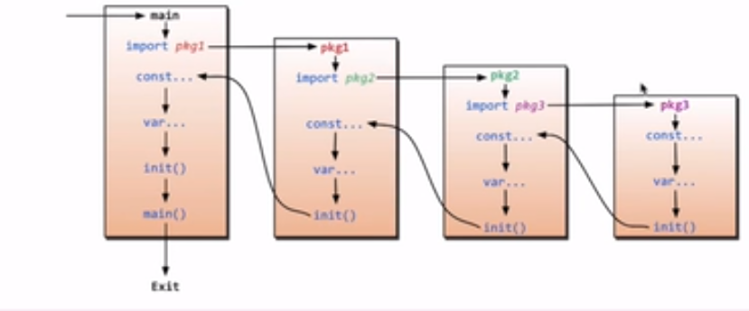
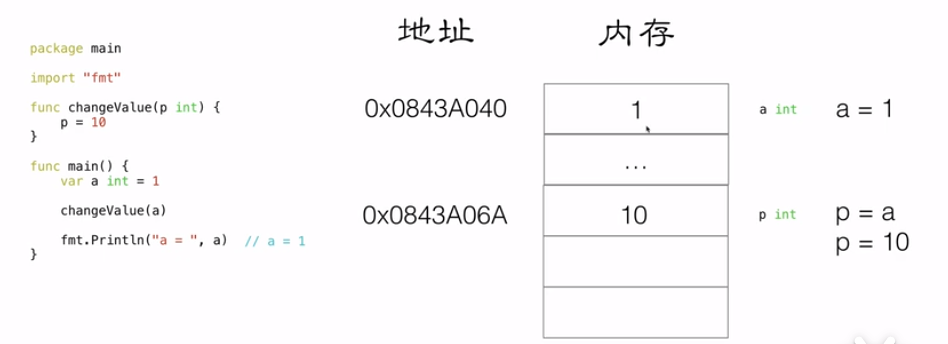
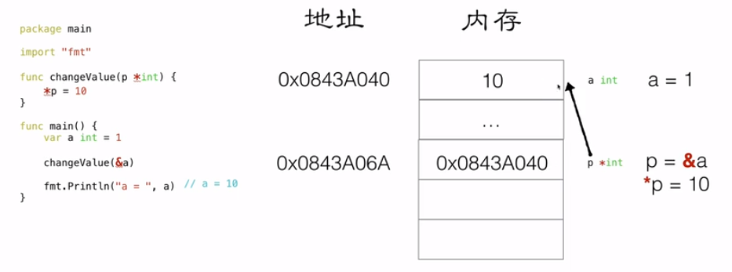
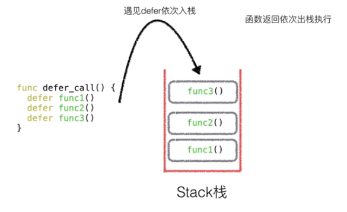
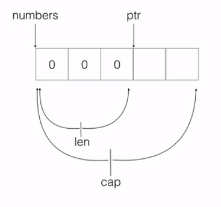
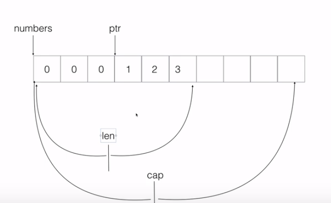

<div style="text-align: center;"><h1>GO 学习笔记 </h1></div>


# 文件模块初始化

+ 先判断是否有导包`import`，若有按顺序依次进入到该文件，并循环判断，直到无导包为止
+ 先初始化常量（或枚举）`const`
+ 初始化全局变量`var`
+ 执行初始化函数`init()`
+ 返回上一个入口，如此往返，直到最初的入口
+ 执行主函数`main()`



# 指针

## 1. 值传递

+ 先对形参开辟内存 并赋默认值
+ 将实参的值赋值给形参 （仅改变行参的值）
+ 在调用函数内对形参进行操作
  

## 2. 地址传递

+ 形式参数是某一个类型的地址
+ 实际参数为地址 使用`&`可以获取变量地址
+ 形式参数储存的是实际参数的地址
+ 在调用函数内实际上是对地址指向的内存进行操作(使用`*`可以获取地址对应内存的变量)

**指针可以嵌套，可以获取指针的指针，多个`*`也可以分别获取低级指针的地址或实际值**


# 关键字特性
## 1. var和:=
+ 变量类型有`int\8\16\32\64`整形、`string`字符串、`bool`布尔、`float32\64`浮点形,默认值为内存全0,不存在为`nil`
+ `var`用来声明变量,形式如`var name type`或`var name type = value`，使用`var name=value`可以省略类型进行推导
```go
var(
f1 int
f2 string
f3 float32
f4 bool
)

```
+ 当多个变量需要声明时，可以使用`var(name1 type1,name2 type2,……)`
+ `name := value` 可以省略type和var进行类型推导
+ `:=`不能用于全局变量赋值

## 2. const 和 iota
+ `const`用于定义常量格式为`const name type = value`或`const name = value`
+ 用于定义枚举变量`const(name1=value \n name2=value)`
+ 若使用`iota`可以让枚举自动按数字和规则递增,**`iota`初始为0，每一行+1,每一行的计算规则和上一行一致**
```go
const(
	CN = iota + 5
	USA
	JP= iota*10
	FH
)
// CN=5 USA=6 JP=20 FH=30
```
## 3. func
+ `func` 用于定义函数，格式为`func name(per)(return){}`,可以定义多个参数和多个返回值
+ 返回值可以以形参的方式进行声明,其默认值为内存0填充,在函数体中可以对其进行赋值,**若不return值将返回声明的返回形参**
+ 调用有返回值的函数,可以接收多个返回值,**若接收个数少于返回个数,按照返回声明的先后顺序返回之前的**
```go
func funcsn(str string, num int) (ans1 int, ans2 string) {
	fmt.Println("str= ", str)
	fmt.Println("num= ", num)

	// 直接返回两个也可以
	//return 100,"ans"

	ans1 = num * 10
	ans2 = str + "a"
	return
}
```

## 4. defer
+ `defer`关键字 修饰的语句 将在其他当前函数体内其他语句执行完毕，函数调用结束前生效

+ **若有多个 `defer` 关键字 ，将依次压栈，按照先进后出原则执行**

+ **若`return`调用函数 且存在`defer` 语句 则 `return`先于`defer`执行  (`defer`最先入栈，在`}`前被调用)**
  
## 5. type和struct
+ `type`关键字可以声明自定义的类型或者是已有类型的别名,`type name TYPE`
+ `struct`可以声明结构体,配合`type`可以声明自定义类型
```go
type num int

type stu struct {
name string
age int
isBoy bool
}

func main() {
	// 和普通类型一样使用
	var nums num =10
	fmt.Println(nums)
    var student stu
    fmt.Println(student)
}
```

# 数据结构
## 1. slice
+ 固定数组在传递时为值传递 且形参和实参必须是统一类型（类型、长度）
+ 当数组不声明长度是为切片(`slice`),是可变长度的动态数组,其作为参数时传递的是 引用
+ 动态数组是内存的切片，可以使用`make()`来声明类型、大小和容量并开辟内存空间，其头指针在最前，尾指针指向最后一个合法元素
+ 若初始化切片时候没有声明容量，容量将和大小相同  
+ 长度`len`表示是当前空间中合法的内存数量（头尾指针间的数量，有值）,,容量`cap`表示切片容量大小(已经开辟的内存空间),使用`append()`可以在之后追加

+ 若容量已满后继续追加，**将按照之前容量扩大一倍**  

+ 可以使用`[a:b]`来对`slice`进行切片(**引用拷贝**),**脚标左闭右开**,一边留空表示从头或尾部，两边留空表示拷贝全部
+ 使用`copy(new,org)`可以将org的值复制给new(**值拷贝**),new容量不足时会自动开辟，但类型需一致

## 2. map
+ 使用`map[key]value`可以声明键值对并声明键值类型
+ 使用`map[k]=v`进行添加操作
+ 使用`delete(map,k)`进行删除操作
+ 使用`map[ok]=nv`进行修改操作
+ 使用`map[k]`进行查找获取值
+ **当删除key不存在时不会报错，当查找key不存在时为相同类型的0内存填充**

# 面向对象
## 1. 结构体struct
+ `struct`可以声明结构体,配合`type`可以声明自定义类型
```go
// 声明一个结构体
type stu struct {
	name string
	age int
	isBoy bool
}
```
+ 使用`name.key`可以给结构体内的属性赋值,也可以使用`name := obj{a,b,c}`来推导声明并赋值一个自定义类型
+ 在函数中当自定义对象作为参数时候其为**值传递**
+ **只有显示声明为指针传递才会传递地址**
```go
// 值传递 实参的副本
func addAgeV(student stu){
	student.age=student.age+1
	fmt.Printf("-------------addAgeV------\n the  is %T the value is %v \n", student, student)
}

// 指针传递 实参的地址
func addAgeO(student *stu){
	student.age=(student.age)+1
	fmt.Printf("-------------addAgeO------\n the  is %T the value is %v \n", student, student)
}
```

（未完待续）